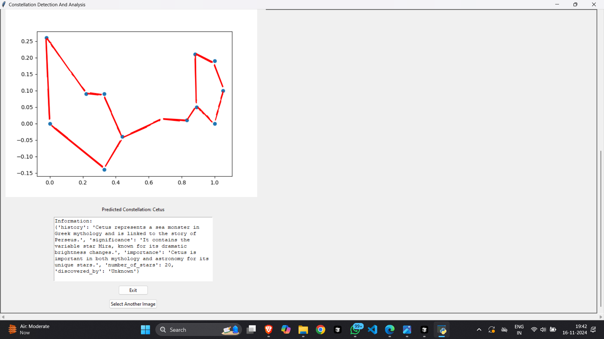

## Overview
This project identifies constellations from input images using a pre-trained TensorFlow model, processes the images for graph-based analysis, and displays the results in a graphical user interface (GUI). The program combines machine learning techniques with image preprocessing and visualization.

## Project Components
**`one.py`**: Main script for running the GUI-based constellation detection application.
- **`preprocess.py`**: Module for preprocessing input images to extract features and prepare them for detection and classification.
- **`gnn.py`**: Script to train and utilize a Graph Neural Network (GNN) model for constellation detection using graph-based representations.

### `one.py`: Main GUI Application
This script orchestrates the constellation detection pipeline, from loading an image to displaying results.


## Key Functionalities
- **Model Loading**: Loads the TensorFlow SavedModel for prediction.
- **Preprocessing**: Resizes and normalizes images for model input.
- **Prediction**: Classifies the input image into one of 30 constellations.
- **Graph Image Loading**: Fetches a corresponding graph representation of the detected constellation.
- **Class Information**: Retrieves detailed information about the detected constellation from a JSON file.
- **GUI**: Implements a user-friendly interface using Tkinter to display the original image, graph, and textual details.

## How to Run
1. Ensure the required dependencies (`cv2`, `tensorflow`, `numpy`, `tkinter`, `PIL`) are installed.
2. Place the constellation graph images in the `Normalised_Templates` folder and the constellation information in `constellation_info.json`.
3. Run the script: python one.py

#### Key Functionalities:
- **Feature Extraction**: Extracts keypoints using ORB (Oriented FAST and Rotated BRIEF).
- **Graph Representation**: Converts extracted features into graph structures.
- **Normalization**: Scales features for consistent input to the detection model.

#### Usage:
```python
from preprocess import ConstellationDetection
constellation_detector = ConstellationDetection("g")
constellation_detector.process_image(image_path)
```

#### Dependencies:
- **cv2**: For image processing and feature extraction.
- **numpy**: For numerical computations.

### `gnn.py`: Graph Neural Network Model
This script trains and applies a GNN for constellation detection. It uses weighted nodes and multi-head attention mechanisms for better performance.

#### Key Functionalities:
- **Graph Construction**: Builds graphs from star coordinates and connections.
- **GNN Training**: Trains a GNN model to classify constellations based on graph features.
- **Prediction**: Uses the trained model to predict the constellation class from input graphs.

#### Usage:
1. Ensure the required libraries (`torch`, `torch_geometric`) are installed.
2. Train or load the GNN model and use it as follows:
   ```python
   from gnn import ConstellationGNN
   model = ConstellationGNN()
   ```

#### Dependencies:
- **torch**: For deep learning functionalities.
- **torch_geometric**: For graph-based learning and operations.

## Installation and Setup
1. Clone the repository and navigate to the project folder:
   ```bash
   git clone <repository-url>
   cd <repository-name>
   ```
2. Install dependencies:
   ```bash
   pip install -r requirements.txt
   ```
3. Place all necessary assets (model, graph images, JSON) in their respective directories.

## Running the Application
Start the GUI application by executing `one.py`:
```bash
python one.py
```

## Future Work
- Enhance the GNN model for improved accuracy.
- Add support for additional constellations.
- Enable real-time image capture and detection.

# Constellation Detection and Analysis

## Results

### Detection Results
The image below shows the detected constellation after processing the input image.



### How It Works:
- The system processes the image using the pre-trained model.
- It identifies the constellation and displays the results on the GUI.


## License
This project is open-source and available under the MIT License.
